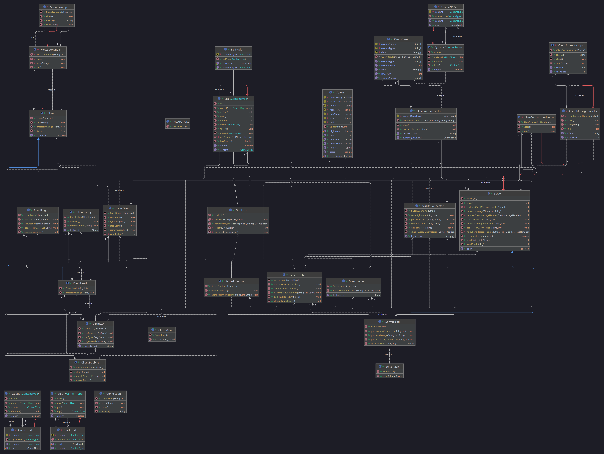

# Typing-Game

---
Dies ist ein **netzwerkbasiertes** Typing Game auf Basis der Java Netzwerkklassen des Schulministeriums NRW.

## Spielprinzip

---
Sinn des Spieles ist, in einer öffentlichen Lobby gegeneinander das "Lorem Ipsum" auf Zeit zu schreiben. Wer innerhalb von 2 Minuten die höchste Punktzahl hat, gewinnt und kann, wenn er angemeldet war, sein Highscore hochladen.

## Entstehung

---
Dieses Projekt ist innerhalb von **26 Stunden programmieren entstanden im Livestream** auf Twitch.
Es war eine kleine Projektarbeit in meinem Informatikleistungskurs.

➔[Twitch: ScreepCode](https://twitch.tv/ScreepCode)

## Feedback

---
Bei Fragen zum Projekt, nutze gerne jeden Weg, entweder über meinen Kontakt auf meiner Webseite oder direkt in einem der Livestreams (oder auch persönlich ^^).

## Dokumentation

---
Eine schriftliche Dokumentation zum Netzwerkverkehr finden sie [hier für den Server](https://github.com/ScreepCode/TypingGame/blob/master/ProtokollServer.txt) und [hier für den Client](https://github.com/ScreepCode/TypingGame/blob/master/ProtokollClient.txt)

Zur Veranschaulichung habe ich hier die Klassendiagramme angefügt, die ein erstes Verständnis über die Funktionsweise geben können. ^^

####Gesamtes Projekt:

####UML zum Server:

####UML zum SpielClient:

